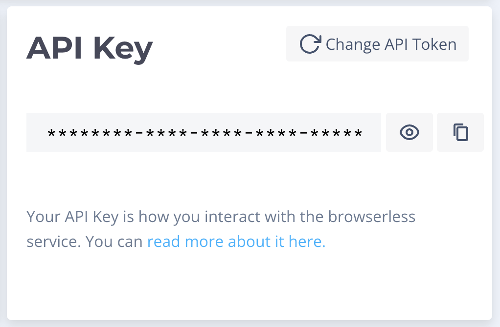

Some websites are partially (or entirely) rendered on the client (aka your web browser). If you try to search the initial HTML for elements that haven’t finished rendering, you won’t find them.

One solution is to use a headless browser that runs a web browser in the background that fetches the page, renders it, and *then* allows you to search the final document.

Headless browsers aren’t a good fit for Val Town due to the amount of resources they require to run. However, services like [Browserless](../browserless.io) provide APIs to interact with a hosted headless browser. For example, their [/scrape API](https://www.browserless.io/docs/scrape).

## 1. Sign up to Browserless and grab your API Key

Copy your API Key from [https://cloud.browserless.io/account/](https://cloud.browserless.io/account/) and save it as a Val Town secret as `browserlessKey`.

## 2. Make an API call to the [/scrape API](https://www.browserless.io/docs/scrape)

Check the documentation for the [/scrape API](https://www.browserless.io/docs/scrape) and form your request.

For example, here’s how you scrape the introduction paragraph of OpenAI’s wikipedia page.

  <iframe src="https://www.val.town/embed/vtdocs.browserlessScrapeExample" width="100%" frameborder="no" style="height: 400px;">
    &#x20;
  </iframe>

Browserless also has more [APIs](https://www.browserless.io/docs/start) for taking screenshots and PDFs of websites.

## 3. Alternatively, use Puppeteer and a browser running on Browserless

You can use the [Puppeteer](https://pptr.dev/) library to connect to a browser instance running on Browserless.

Once you’ve navigated to a page, you can run arbitrary JavaScript with `page.evaluate` – like getting the text from a paragraph.

  <iframe src="https://www.val.town/embed/vtdocs.browserlessPuppeteerExample" width="100%" frameborder="no" style="height: 400px;">
    &#x20;
  </iframe>

