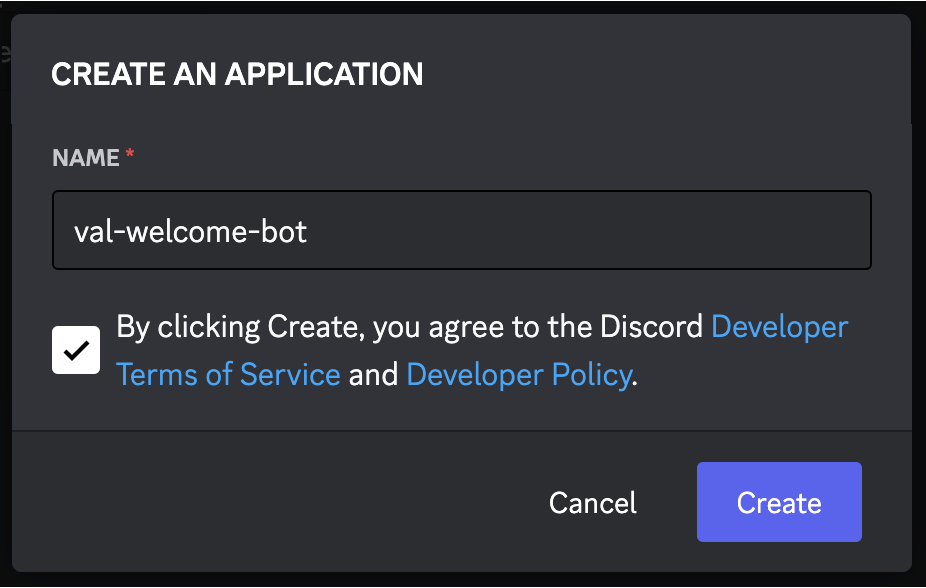
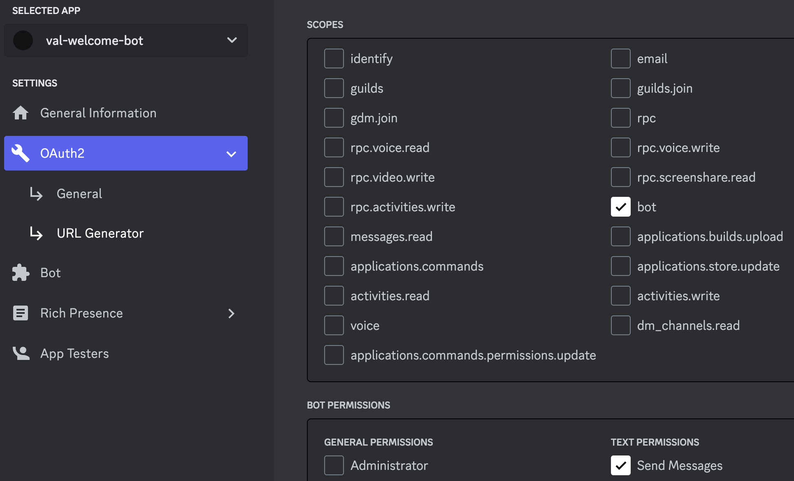
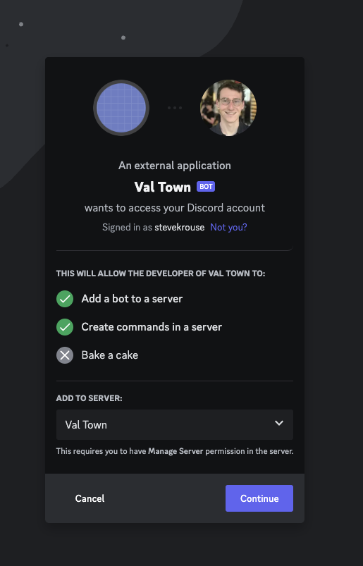

You can create a Discord welcome bot using scheduled vals.

In this example, a scheduled val gets the most recent members for your server and sends a DM to new users from a bot that you’ll create. It avoids messaging users who joined the server before the bot was added.

When users reply to the bot, the message is forwarded as a DM.

# 1. Create a new Discord application

Visit [https://discord.com/developers/applications](https://discord.com/developers/applications):

# 2. Enable the server members intent

Since the bot will be requesting a list of guild members, you need to enable the **SERVER MEMBERS INTENT** on the **Bot** tab.

# 3. Get your bot’s token

On the **Bot** tab, copy the **TOKEN**, and save it as a Val Town secret as `discordBot`.

# 4. Create a link via the URL Generator

On the **OAuth2** tab, under **URL Generator,** select the **bot** scope, and give it permission to **Send Messages**, and then copy the **GENERATED URL** at the bottom of the page.

# 5. Click on the generated link

Choose the server you want to invite the bot to and press ****************Continue****************.

# 6. Get your Server ID

Save your server id as a Val Town secret as `discordServerId`. (See: [Where can I find my User/Server/Message ID?](https://support.discord.com/hc/en-us/articles/206346498-Where-can-I-find-my-User-Server-Message-ID-))

# 7. Setup your welcome message scheduled val

Fork this scheduled val that will send a welcome message to new users.

  <iframe src="https://www.val.town/embed/vtdocs.discordWelcomeBotCron" width="100%" frameborder="no" style="height: 400px;">
    &#x20;
  </iframe>

This val stores state in three other vals.

* `@me.discordWelcomeBotStartedAt` stores the timestamp of the bot’s creation so that everyone who’s already on the server doesn’t get a welcome message when the bot is added.
* `@me.discordWelcomedMembers` stores the ids of everyone that has been messaged so that they don’t receive another message.
* `@me.discordDMs` stores the channel ids (each time the bot DMs a user it creates a channel) so that we can check for replies to the bot.

These vals will be automatically created if they don’t already exist.

# 8. Get your User ID

Save your user id as a Val Town secret as `discordUserId`. (See: [Where can I find my User/Server/Message ID?](https://support.discord.com/hc/en-us/articles/206346498-Where-can-I-find-my-User-Server-Message-ID-))

This is so the bot knows where to forward user replies.

# 9. Setup your message forwarder scheduled val

Fork this scheduled val that will forward user replies to your Discord user.

  <iframe src="https://www.val.town/embed/vtdocs.discordWelcomeBotMsgForwarder" width="100%" frameborder="no" style="height: 400px;">
    &#x20;
  </iframe>

This val loops through all of the DMs between the bot and new users. It checks for any new replies and then forwards these messages as a new DM (from the bot, to your Discord user).
