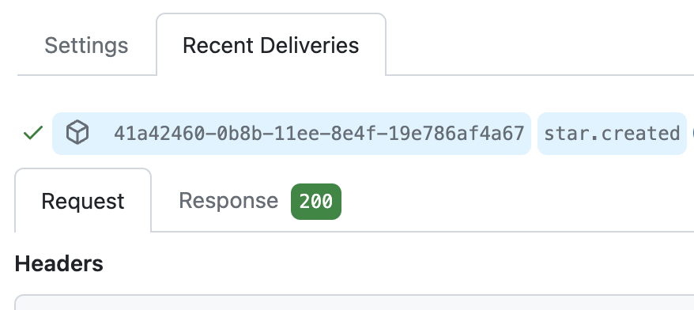

GitHub supports sending webhooks for a [number of events](https://docs.github.com/en/webhooks-and-events/webhooks/webhook-events-and-payloads). In this example, you’ll use `[console.email](http://console.email)` to receive an email when someone stars your GitHub repository.

First, create an Web API handler function val to receive star webhooks from GitHub, or fork this one:

  <iframe src="https://www.val.town/embed/neverstew.githubStarWebhook" width="100%" frameborder="no" style="height: 400px;">
    &#x20;
  </iframe>

Go to the **Webhooks** tab in your GitHub repository’s settings.

Get your val’s web endpoint URL (via the menu) and paste it in the **Payload URL.**

Be sure to set the content type to `application/json` so that it’s super easy for us to extract the data out of it.

You can filter for the specific events you want to receive, or opt to choose everything.

To just star events, toggle the checkbox inside *Let me select individual events.*

When your GitHub repository is starred, GitHub will sends a webhook payload, which is handled by your val, and you get an email!

You can debug this on the GitHub side by looking at the Recent Deliveries page of your webhook.

## Securing GitHub Webhooks

Once public, your val function will listen for any payload sent to its endpoint. For security reasons, you probably want to limit requests to those coming from GitHub. One method is to add a secret token and perform validation.

Edit your existing webhook on GitHub and in the **Secret** field, add a random string with high entropy. Add this to your [secrets](https://docs.val.town/secrets) on Val Town as `githubWebhookToken`.

GitHub uses this secret to create a hash signature with each payload. This hash signature is sent as a header: `x-hub-signature-256`.

With your secret, the payload, and the signature header, you can use Octokit’s `[verify](https://github.com/octokit/webhooks.js/#webhooksverify)` function to confirm that the webhook came from GitHub. Here’s a val that does that for you:

  <iframe src="https://www.val.town/embed/vtdocs.verifyGithubWebhookSignature" width="100%" frameborder="no" style="height: 400px;">
    &#x20;
  </iframe>

It can be integrated into the original example like this:

  <iframe src="https://www.val.town/embed/neverstew.githubWebhookWithVerify" width="100%" frameborder="no" style="height: 400px;">
    &#x20;
  </iframe>

With your webhook pointing to the new example, your val now refuses payload that don’t come from GitHub!

Read more: GitHub has an in-depth guide on [Securing your webhooks](https://docs.github.com/en/webhooks-and-events/webhooks/securing-your-webhooks).
