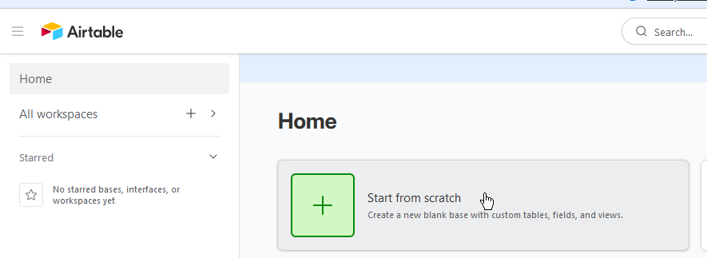
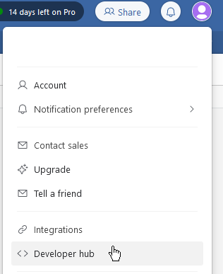
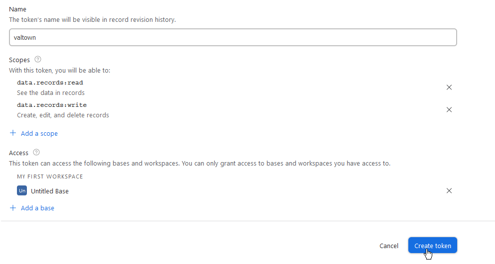

Airtable is a spreadsheet-database hybrid. Note that because [val.town](http://val.town) uses Deno, an unofficial client library has to be used.

## Setup

On the homepage, click Start from scratch to create a base:

If prompted with automatic setup, click Skip. You should get a new base with a blank table.

Adjust the table fields as you want (note that this isn’t covered by this guide).

Click on your profile icon, then on Developer hub:

Click Create new token.

Fill out the fields:

* Name: Any. For example, `valtown`.
* Scopes: You’ll most likely want to add `data.records:read` and `data.records:write`.
* Access: Add the base you created earlier.

Lastly, click Create token. Here’s an example of how your settings could probably look like:

Copy your token and click Done.

Go to [val.town](http://val.town), click on your username and then on Secrets:

Click New secret. Set the key to a name you want to use to reference the token (for example, `airtable_pat`) and paste the copied personal access token into the value, then click Add.

You can then use Airtable from [val.town](http://val.town) like so:

  <iframe src="https://www.val.town/embed/mattx.airtable_deno_sample" width="100%" frameborder="no" style="height: 400px;">
    &#x20;
  </iframe>

Make sure to change:

* apiKey if you have used a different name for your secret.
* baseId to the ID of your base. You can find it in the URL bar while a table is open and it will likely start with `app`:

* tableName to either the name of your table or the table ID which can also be found in the URL after the base ID (see above).
