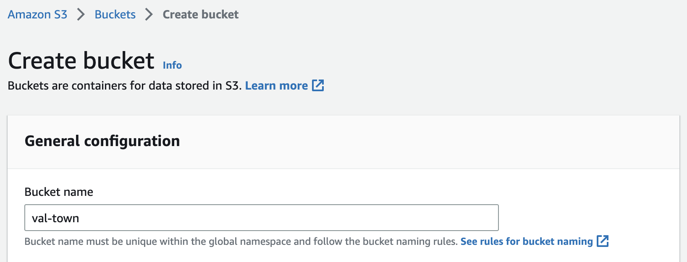
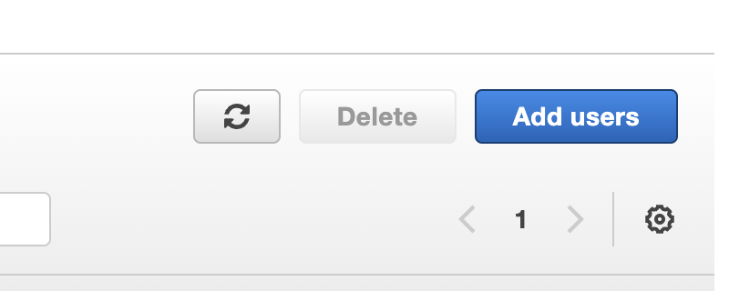
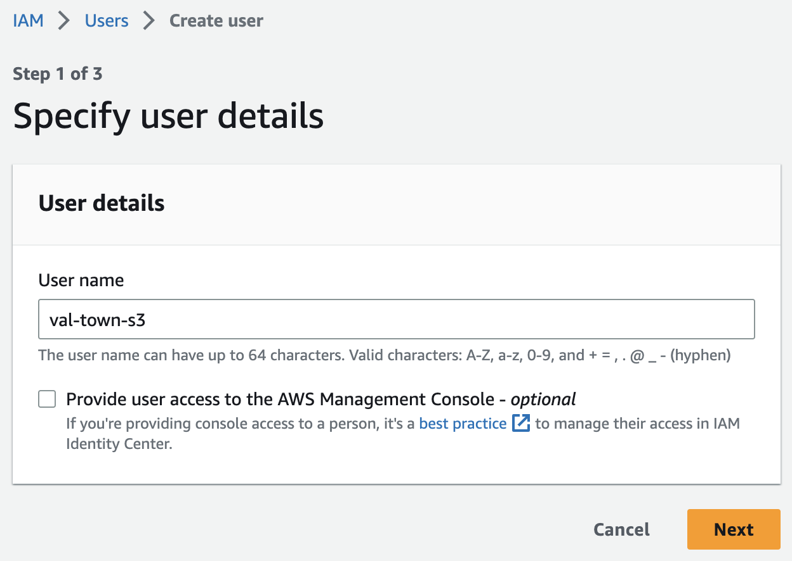
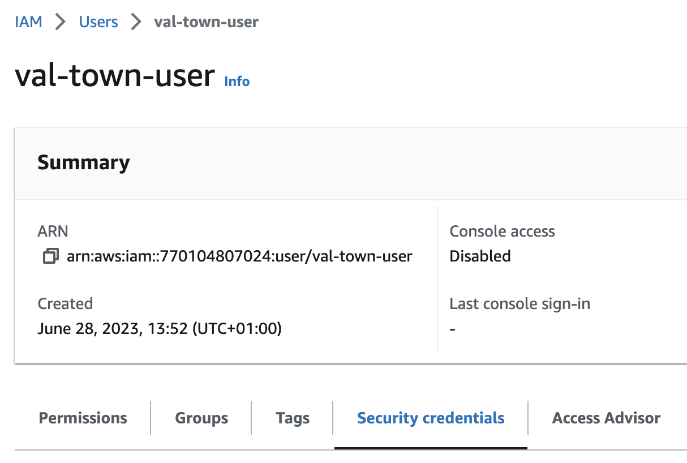
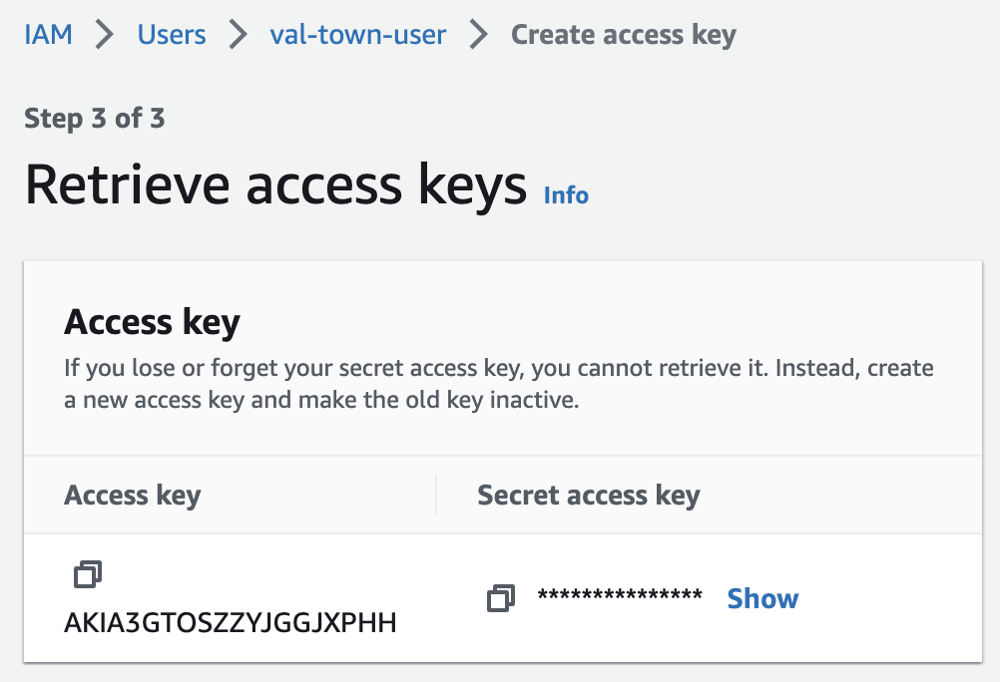

You can upload and download from AWS S3 inside val functions.

In this guide, you’ll create an AWS bucket, an IAM user, and then test your set
up is correct by uploading and downloading a small text file.

# 1. Create an AWS bucket

Log in to the AWS Console and go to
[https://s3.console.aws.amazon.com/s3/bucket/create](https://s3.console.aws.amazon.com/s3/bucket/create)

Create a new bucket by choosing a **Bucket name** (leave the defaults for
everything else).

Save the **Bucket name** and your AWS region as
[Val Town secrets](https://www.val.town/settings/secrets) as `awsS3Bucket` and
`awsS3Region` respectively. Although these values aren’t _secrets_, doing this
means you can copy and paste the val examples in this guide without making any
code changes.

Continue to use this AWS region for the rest of this guide.

# 2. Create an IAM user

Go to
[https://console.aws.amazon.com/iamv2/home#/users](https://console.aws.amazon.com/iamv2/home#/users)
and click **Add users**.

Choose a **User name**.

Select **Attach policies directly**.

Give this user `AmazonS3FullAccess` by searching and selecting the checkbox
under **Permissions policies**.

(This allows this user the highest level of S3 permissions across all of the
buckets for the AWS account you’re logged into. Consider setting up granular
permissions with AWS’s
[Bucket owner granting its users bucket permissions](https://docs.aws.amazon.com/AmazonS3/latest/userguide/example-walkthroughs-managing-access-example1.html)
guide.)

On the final page, click **Create user**.

# 3. Create access keys for the user

Navigate to **IAM** → **Users** → **<the user you created>**.

In the **Security credentials** tab, click **Create access key**.

In **Step 1**, select **Application running outside AWS**.

In **Step 2**, give your access keys a helpful **Description tag value**.

Finally, copy and save the **Access key** and **Secret access key** as
[Val Town secrets](https://www.val.town/settings/secrets) as `awsS3Key` and
`awsS3Secret` respectively.

# 4. Upload text file

Copy and run the following val in your workspace.

  <iframe src="https://www.val.town/embed/vtdocs.uploadTextToS3" width="100%" frameborder="no" style="height: 400px;">
    &#x20;
  </iframe>

`[putObject](https://deno.land/x/s3_lite_client@0.6.1/mod.ts?s=S3Client&p=prototype.putObject)`
takes any of `ReadableStream<Uint8Array> | Uint8Array | string`.

# 5. Download the text file you just uploaded

Copy and run the following val in your workspace.

  <iframe src="https://www.val.town/embed/vtdocs.downloadTextFromS3" width="100%" frameborder="no" style="height: 400px;">
    &#x20;
  </iframe>

`[getObject](https://deno.land/x/s3_lite_client@0.6.1/mod.ts?s=S3Client&p=prototype.getObject)`
returns a standard HTTP **Response** object which you consumed with
 `.text()`, `.json()`, `.body` (ReadableStream), `.arrayBuffer()`, or `.blob()`.

# 6. More resources!

Documentation for the lite S3 client used in this guide can be found here:
[https://deno.land/x/s3\_lite\_client@0.6.1](https://deno.land/x/s3_lite_client@0.6.1/mod.ts?s=S3Client).
There’s also
[S3’s documentation](https://docs.aws.amazon.com/s3/index.html?nc2=h_ql_doc_s3).

For all other Val Town help, see [our Discord](https://discord.gg/dHv45uN5RY)!
