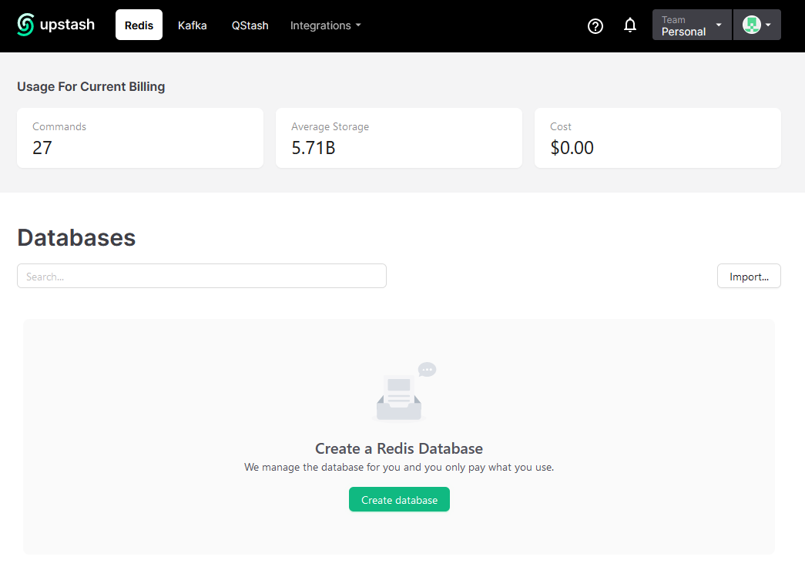
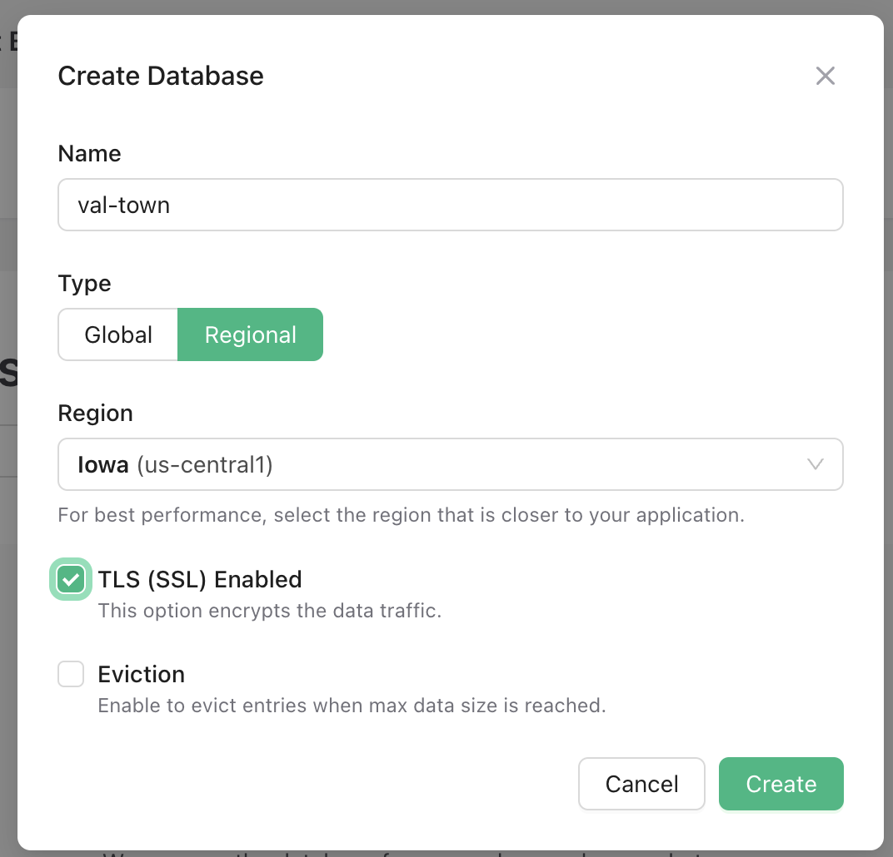

Upstash provides a serverless Redis database, which can be used as a key-value store of up to 1mb with a free account.

## 1. Create an Upstash account

Go to [https://console.upstash.com/login](https://console.upstash.com/login)

## 2. Create a database

1. Click ******************************Create database******************************

1. **Name**: whatever you want.
2. **Type**: Regional
3. **Region**: Iowa (us-central1), because it’s closest to Val Town’s servers.
4. **Enable TLS** for security.

## 3. Add REST credentials to Val Town Secrets

1. Go to [val.town/settings/secrets](https://www.val.town/settings/secrets)
2. For `UPSTASH_REDIS_REST_URL` and the `UPSTASH_REDIS_REST_TOKEN` each:
   1. Click **New secret**.
   2. Set the names to `upstashURL` and `upstashToken`, respectively
   3. Copy & paste in the value
   4. Click ******Add******

Upstash:

Val Town:

## 4. Set some data!

If you set it up correctly, you should be able to copy & paste this Val and have it return the same results from your own Upstash database

  <iframe src="https://www.val.town/embed/stevekrouse.upstashEx" width="100%" frameborder="no" style="height: 400px;">
    &#x20;
  </iframe>

## 5. Saving JSON

JSON is automatically stringified and parsed so you can set it and get it directly. You can store a JSON object of up to 1mb this way with a free acount.

  <iframe src="https://www.val.town/embed/stevekrouse.upstashJSONEx" width="100%" frameborder="no" style="height: 400px;">
    &#x20;
  </iframe>

## 6. Further resources

1. [Upstash Redis SDK Docs](https://docs.upstash.com/redis/sdks/javascriptsdk/overview)
2. [Redis tutorial](https://redis.io/docs/data-types/tutorial/)

Thanks to [@mattx](https://www.val.town/mattx) for contributions to this resource!
